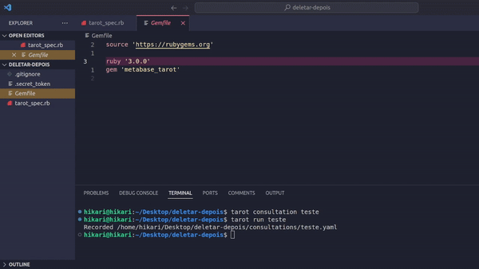

<h1 align="center">🔮 Tarot 🔮</h1>

Para saber o que está acontecendo no seu banco de dados, consultar o <b>Tarot</b> pode ser uma boa!

---

> [!WARNING]
> O nome da gem no RubyGems é "**metabase_tarot**", e não "tarot". Cuidado!

### ⚝ Elevator pitch

O Tarot é uma gem para Ruby 3.0 com a finalidade de se conectar a uma aplicação de Metabase diretamente, usando a API deles. Nessa seção explico alguns motivos para usar o Tarot.

Algumas vezes, usar o front-end do Metabase pode não ser a melhor opção. Com o Tarot, o usuário não precisa navegar aos poucos até a página que está procurando, ele pode apenas rodar a query rapidamente e ter seu resultado. Um outro ponto extra para o Tarot nesse caso é que geralmente uma única página do Metabase faz várias requisições para API, enquanto no Tarot o usuário tem controle sobre isso e pode evitar requisições desnecessárias que podem tomar tempo principalmente em situações críticas de lentidão na aplicação.

Com o tarot, já que a requisição é feita por um script que o usuário escreve, é possível misturar o resultado de várias queries em vários bancos e usar código ruby entre as requisições.

### ⚝ Quickstart

Tendo Ruby 3.0 instalado na sua máquina, execute:

`$ gem install metabase_tarot`

Com isso você vai ter acesso ao comando `tarot`.
Para criar um ambiente Tarot e começar a usar, execute:

`$ tarot new [diretório de sua preferência]`

Para usar o seu novo ambiente Tarot, é necessário estar dentro do diretório dele. Além disso, configure os dados pré-preenchidos em `tarot_spec.rb`:
- `url`: A URL da aplicação Metabase que você quer se conectar
- `session_expire_days`: O tanto de dias que leva para sua sessão expirar. Caso não saiba, deixe o valor pré-preenchido (Não se preocupe, usar um valor errado aqui não terá grandes consequências).
- `database_aliases`: É uma hash de aliases para usar no lugar do nome dos bancos de dados registrados no Metabase. Útil para customizar os nomes quando eles são confusos ou não estão padronizados. Os aliases registrados vão substituir seus respectivos nomes originais. É obrigatório que as chaves dessa hash sejam símbolos.

Tendo um ambiente configurado, veja nas seções abaixo o que você deseja fazer.

### ⚝ Como gravar uma `consultation`

Uma `consultation` no Tarot significa um arquivo que utiliza os utilitários para se comunicar com o Metabase e gerar um arquivo de resultados. Para criar uma, execute:

`$ tarot consultation [nome da sua consultation]`

Um arquivo de consultation contendo um template vai ser criado na pasta `consultations` dentro do seu ambiente Tarot. O mais importante para se saber é que:
- **Apenas a parte do bloco passado para o método `consultation` precisa ser modificado em 99.99% dos casos**
- `db('minha db')` retorna um objeto representando o banco de dados com nome (ou alias) "minha db" no Metabase.
- `db('minha db').query!('select * bla bla bla')` executa a query desejada e retorna o resultado parseado.
- O retorno do bloco passado para o método `consultation` vai aparecer no arquivo de resultados quando você rodar a consultation.

Para rodar a consultation, execute:

`$ tarot run [nome da sua consultation]`

### ⚝ Como abrir o console

Execute: `$ tarot console`

### ⚝ Como ver os bancos de dados disponíveis

Execute: `$ tarot dbs`

### ⚝ Como ver as tabelas disponíveis para um banco de dados

Execute: `$ tarot tables [nome ou alias do banco]`

### ⚝ Como ver as colunas disponíveis para uma tabela de um banco de dados

Execute: `$ tarot cols [nome ou alias do banco] [nome da tabela]`

### ⚝ Observações

Comecei a desenvolver o projeto em português porque ele se originou de um escopo menor, mas tenho a intenção de reescrever a documentação e README em inglês.

Em cada ambiente de Tarot, um arquivo sensível chamado .secret_token é sempre criado para armazenar o token do usuário.

O `tarot new` cria:
- `tarot_spec.rb`
- `Gemfile` contendo a dependência `metabase_tarot`
- `.gitignore` ignorando a pasta `consultations/` e o arquivo `.secret_token`

### Dependências

- Ruby 3.0
